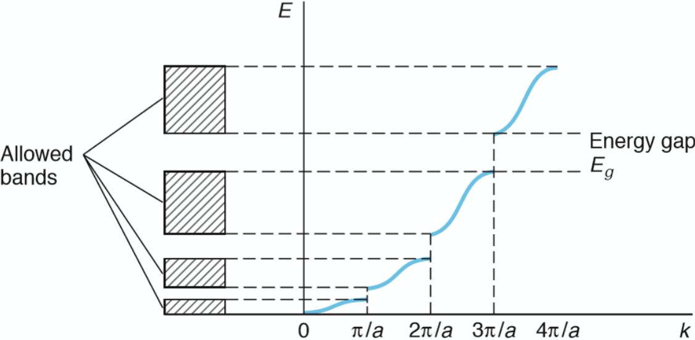

# Semiconductor

A continue of 1-D Schroedigner.

## Multiple Quantum Wells

### 2 Quantum Wells

- For odd states, they are anti-symmetric. They goes to 0 at the center of the well normally when there is one well. Thus, the gap between the two wells will just extend the 0 region slightly. Thus, it will have **slightly shorter wavelength** which means **higher energy**.
- For even states, they are symmetric. They will be splited into two prabaloids. Thus they will have **slightly lower energy** since they does not go to zero at the center of the well.
- All the states split into two states.

### N Potential Wells

- The lowest of the split levels is even, with no zero-crossings in the wavefunction, and is lower than corresponding single-well level.
- An infinite number of identical potential wells is called a periodic potential. 

#### Bloch's Theorem

The Schrodinger solution for a periodic potential has the form:

$$
\psi(x) = u_{K}(x) e^{iKx}
$$

where $u_{K}(x)$ is a periodic function with the same periodicity as the potential. The wavefunction is a plane wave with a periodic amplitude.

#### Krongig-Penney Model

?????

### Energy Bands

For **any** periodic potential, a particle that would be bound in an isolated well with **discrete** energy, can tunnel from well to well with a range of energies. The energy levels form **bands**.
- Any value of Bloch wavevector $K$ will give a solution to the Schrodinger equation.
- Any energy $E$ is roughly a parabola in $K$.

## Chemical bonds

If the separation between the two wells are large enough, there is no significant tunneling. The two wells will be independent. Thus, the energy levels will be the same as the single well.

### simple example

Consider two hydrogen nuclei (protons) and one electron. In quantum mechanics, we should think of **even and wave functions**. 
- Even functions are symmetric, should be considered that the electron is attached to both protons with the same sign.
- Odd functions are anti-symmetric, should be considered that the electron is attached to both protons with the opposite sign.
- Summing up all the functions will result in electron being attracted to one of the protons.

Protons repel each other and the electron is attracted to both. It will reach an equilibrium position where the forces are balanced. This is the **chemical bond**. The distance between the two protons is the bond length.

### level splitting in crystals

In a crystal, the potential is periodic. The energy levels split into bands. The lowest band is called the **valence band**. The next band is called the **conduction band**. The energy gap between the two bands is the **band gap**. Some materials have a small band gap, some have a large band gap. Sometimes the splitting can be so large that the bands overlap.

#### Conductivity

- If a band is not full, there are unoccupied states. Electrons can move freely in the material. This is a **conductor**. It might come from unpaired electrons in the atoms or the overlap of bands.
- If a band is full, there are no unoccupied states. Electrons cannot move freely. This is an **insulator**.
- If a band is completely empty, there are no electrons to move, it does not conduct.

### Semiconductors

- Semiconductors have a small band gap. The band gap is small enough that electrons can be excited from the valence band to the conduction band. This can be done by thermal excitation or by absorbing a photon.

#### Doping

- Doping is the process of adding impurities to a semiconductor to change its properties.
- **N-type** semiconductors have extra electrons. This is done by adding an element with one more electron than the semiconductor. The extra electron is free to move in the conduction band.
- **P-type** semiconductors have extra holes. This is done by adding an element with one fewer electron than the semiconductor. The hole is free to move in the valence band.

#### PN Junction

Start with a pure silicon wafer. Diffuse some P-type impurity into the whole thickness. Then diffuse enough N-type impurity into the whole thickness. Then diffuse enough N-type impurity to reverse the polarity, but just of the surface. 

The electrons and wholes neutralize each other in a thin **depletion layer** that has the low conductivity of pure silicon. 

When a voltage is applied, the depletion layer shrinks and the current flows.

When a photon is absorbed, an electron-hole pair is created. The electron and hole are attracted to the opposite sides of the junction. This creates a current.

When a reverse voltage is applied, the depletion layer grows and the current stops. But if the voltage is too high, the current will flow in the reverse direction.

#### Shockley Diode Equation

The current through a diode is given by:

$$
I(V) = I_s \left( e^{\frac{qV}{nk_B T}} - 1 \right)
$$

- $I_s$ is the saturation current.
- $V_T = \frac{k_B T}{q}$ is the thermal voltage.
- $n$ is the ideality factor. About 1 for Germanium, 2 for Silicon.

#### Light Emitting Diodes

When a current flows through a diode, the electrons and holes recombine. The energy released is emitted as a photon. The energy of the photon is equal to the band gap of the semiconductor.

#### Bipolar Junction Transistor

A bipolar junction transistor is a sandwich of P-type and N-type semiconductors. The current through the transistor is controlled by the current through the base.

#### Field Effect Transistor

A field effect transistor is a sandwich of P-type and N-type semiconductors. The current through the transistor is controlled by the voltage on the gate.